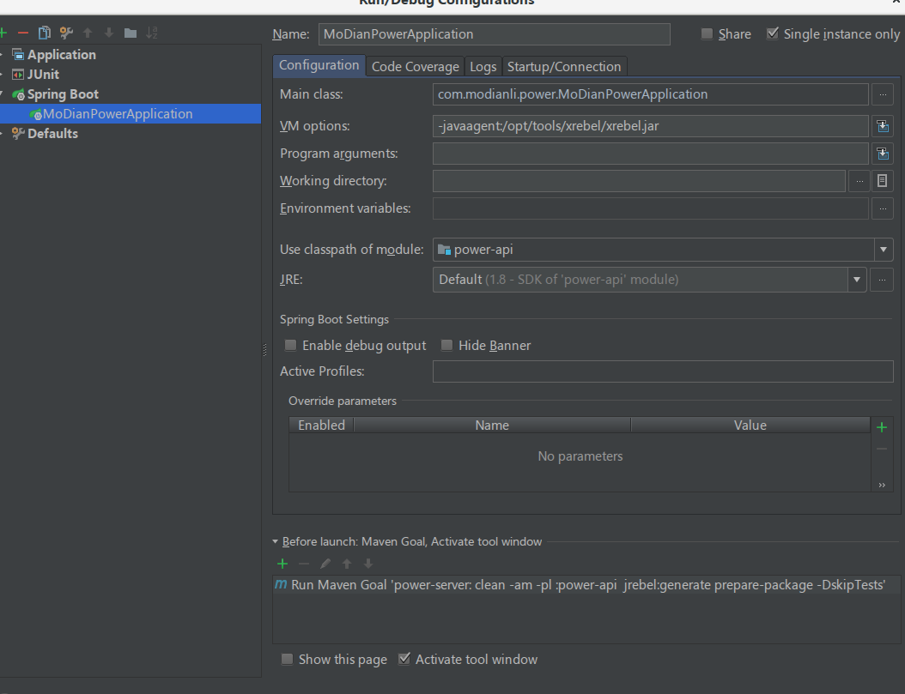

install lombok plugin [link](https://github.com/mplushnikov/lombok-intellij-plugin)
install .ignore
install jrebel

idea 导入 settings.jar

项目运行

    mvn clean -am -pl :power-api  jrebel:generate prepare-package -DskipTests
    
---  
    index                       type                  alias
    quote_v1                    product_price         product_price
    category_property_v1        category              category_property
    equipment_v1                all_category          equipment
    equipment_v1                hot_category          hot_category
    product_v1                  product               product

## user role
###七牛
    获取七牛上传token
    
###需求
    企业新增需求 企业认证状态 企业发布需求列表
    企业选择供应商
    
###用户
    用户详情 完善认证信息

## enterprise role
###需求
    供应商报价 供应商接单 供应商配单列表